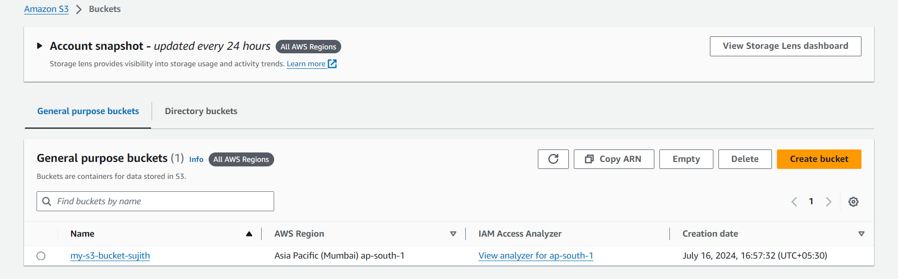

# Write a policy to transition objects to the S3 Glacier storage class after 30 days and delete them after 365 days and use any scripting language
## create a s3 bucket and upload a file to it




# click on the management in that bucket


* write a Lifecycle rule name
* choose a rule scope
* Lifecycle rule actions
  
    * click on move current versions of objects between storage classes and permanently delete noncurrent versions of the objects
    
    
    
* Transition current versions of objects between storage classes
* choosestorage class transition to Glacier Archieve and days after object creation and acknowledged
* Permanently delete noncurrent versions of objects in this days after object become noncurrent choose days you want.
* click on create rule.


## Task completed need to wait for 2days to delete

## Above task in scripted one
* Created a EC2 instance
* Create a role and attach a S3 full access
* Assign that role to ec2 instance.
* create a json file

```json 
{
    "Rules": [
        {
            "ID": "MoveToGlacierAndExpire",
            "Filter": {
                "Prefix": ""
            },
            "Status": "Enabled",
            "Transitions": [
                {
                    "Days": 1,
                    "StorageClass": "GLACIER"
                }
            ],
            "Expiration": {
                "Days": 2
            },
            "NoncurrentVersionExpiration": {
                "NoncurrentDays": 2
            }
        }
    ]
}
```

## Create a S3 bucket and upload files to that.

* Run this command with your bucket name and json file name.

```json
aws s3api put-bucket-lifecycle-configuration --bucket my-s3-bucket-sujith --lifecycle-configuration file://lifecycel.json
```
* check the bucket life cycle management
* above details will be reflected in that life cycle management.


# Task completed.


